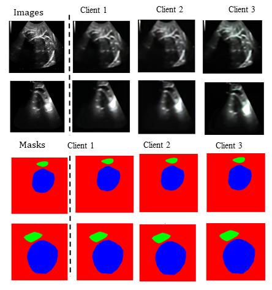
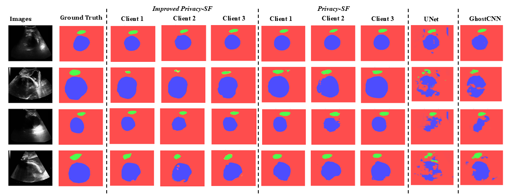
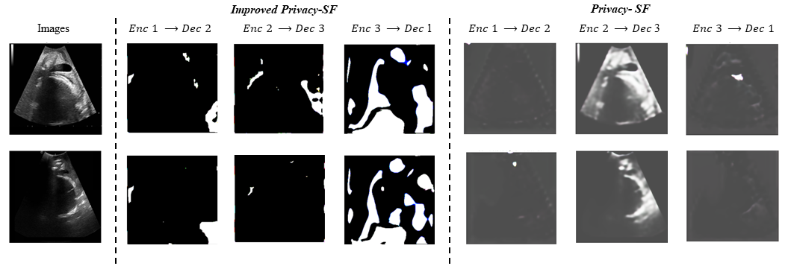

# Improved Privacy-SF: Privacy-Preserving Collaborative Medical Image Segmentation Using Latent Transform Networks

This repository provides the official implementation of **Improved Privacy-SF**, a privacy-preserving collaborative medical image segmentation framework that enables multi-institutional learning **without sharing raw images, masks, or unprotected latent features**.

The framework extends the original Privacy-SF by introducing:
- **Skip-connected image and mask autoencoders**
- A **Keyed Latent Transform (KLT)** for client-specific latent protection
- A **Unified Mapping Network (UMN)** with Pyramid Pooling
- Strong resistance to **latent inversion** and **membership inference attacks**
- Efficient **real-time inference** with low communication overhead

📄 **Paper**: *Privacy-Preserving Collaborative Medical Image Segmentation Using Latent Transform Networks*  
📊 **Datasets**: PSFH (Ultrasound), Ultrasound Nerve, FUMPE (CTA), Cardiac MRI  
🧠 **Framework**: Pytorch

---

## 🔍 Why Privacy segmentation framework?

Medical image segmentation models require large, diverse datasets, but privacy regulations prevent hospitals from sharing raw scans. Traditional federated learning still leaks information through gradients and requires heavy communication.

**Improved Privacy-SF shifts collaboration into the latent space**, ensuring:
- Raw data **never leaves the client**
- Only **protected, non-invertible latents** are exchanged
- Segmentation performance approaches **privacy-unaware baselines**

---

## 🧠 Method Overview

### Training Phase

Each client independently trains:
- An **image autoencoder** `(Ex, Dx)`
- A **mask autoencoder** `(Ey, Dy)`

Multi-scale latent features are extracted and **secured using client-specific Keyed Latent Transforms (KLT)** before transmission.

The server:
- Applies the **inverse transform**
- Trains a **Unified Mapping Network (UMN)** to map image latents → mask latents
- Never accesses raw images, masks, or unprotected latents

### Inference Phase

1. Client encodes image and applies KLT  
2. Server inverts transform → predicts mask latents → re-applies transform  
3. Client removes protection and decodes segmentation mask  

---

## 🧩 Architecture Diagram

> **Figure 1 – Improved Privacy-SF pipeline**  
> *(Training and inference configuration with client-side transforms and server-side mapping)*

  

---

## 🔐 Keyed Latent Transform (KLT)

Each client applies a **lightweight, reversible, orthogonal transform** to its latent features:

\[
z' = T(z) = Q^T z + b
\]

\[
z = T^{-1}(z') = Q (z' - b)
\]

- `Q`: client-specific orthogonal matrix  
- `b`: client-specific bias vector  
- Preserves differentiability and semantic structure  
- Prevents cross-client decoder inversion  

---

## 🧠 Unified Mapping Network (UMN)

The server-side UMN performs **latent-to-latent translation** using:
- Inverted encoder–decoder hierarchy
- Pyramid Pooling Module (1×1, 3×3, 5×5, 7×7)
- Skip connections for spatial fidelity

> **Figure 3 – Multi-client collaboration**

  

---

## 📊 Experimental Results

### Autoencoder Reconstruction Quality (PSFH)

| Model | Image PSNR ↑ | Image SSIM ↑ | Mask PSNR ↑ |
|------|-------------|--------------|-------------|
| Privacy-SF | ~24.7 | ~0.49 | ~30.4 |
| **Improved Privacy-SF** | **~26.1** | **~0.70** | **~34.5** |

> **Figure 4 – Autoencoder reconstructions**

  

---

### Segmentation Performance (PSFH)

| Model | Dice ↑ | IoU ↑ |
|------|-------|-------|
| U-Net | 0.81 | 0.70 |
| Ghost-CNN | 0.84 | 0.74 |
| Privacy-SF | 0.86 | 0.77 |
| **Improved Privacy-SF** | **0.89** | **0.80** |

> **Figure 5 – Qualitative PSFH results**

  

---

### Cross-Dataset Generalization

| Dataset | Privacy-SF Dice | Improved Privacy-SF Dice |
|-------|----------------|--------------------------|
| Nerve (US) | 0.57 | **0.68** |
| FUMPE (CTA) | 0.66 | **0.74** |
| MRI Heart | 0.75 | **0.88** |

> **Figure 6 – Multi-modal segmentation**

  

---

## 🛡️ Privacy Evaluation

### Cross-Decoder Inversion

- Baseline Privacy-SF allows partial reconstruction
- **Improved Privacy-SF outputs are visually uninformative**

> **Figure 7 – Cross-decoder reconstructions**

  

---

### Membership Inference Attacks (MIA)

| Variant | AUC |
|-------|-----|
| Full Model | **0.456** |
| No KLT | 0.499 |
| No PPM | 0.456 |
| No Skips | 0.467 |

*AUC ≈ 0.5 ⇒ random guessing*

---

## ⚡ Runtime & Communication Cost

| Component | Time (ms) |
|---------|-----------|
| Client Encode + KLT | 2.48 |
| Server Mapping | 14.03 |
| Client Decode | 2.56 |
| **Total** | **19.07 ms** |

- Payload: **~0.88 MB per query**
- Supports real-time clinical workflows

